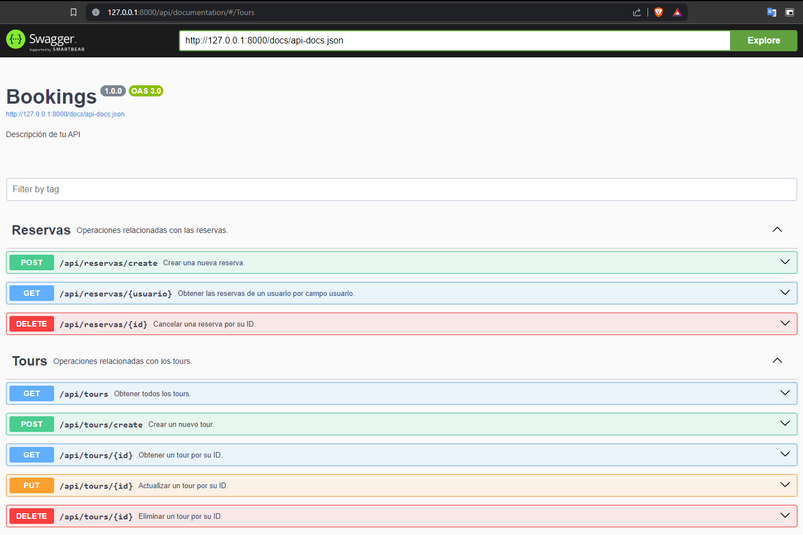
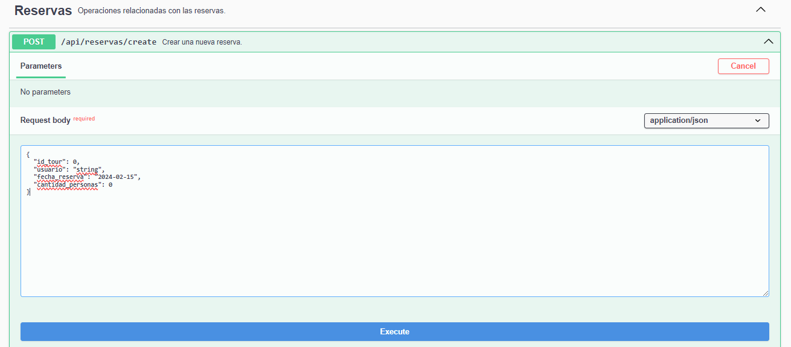
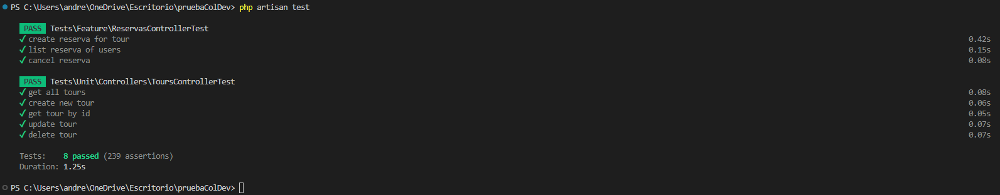
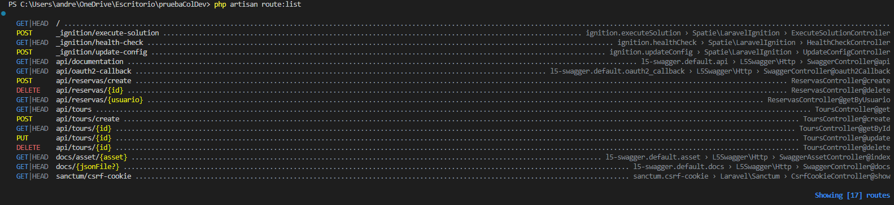

## Prueba Técnica ColDevs

### Objetivo de la prueba
Desarrollar una API Restful utilizando Laravel para gestionar el booking de tours. La API permitirá a los usuarios realizar operaciones CRUD (Crear, Leer, Actualizar, Eliminar) sobre los tours y las reservas. La prueba evaluará la capacidad del candidato para trabajar con Laravel, incluyendo la creación de migraciones, modelos , controladores, rutas API, factories para datos de prueba y pruebas.

## Tecnologías utilizadas

* PHP
* Laravel
* Composer
* Swagger
* MySQL

## Estado del proyecto

## Instalación

Para la instalación se deben seguir los siguientes pasos:
1. Ejecutar para clonar repositorio desde GitHub: git clone https://github.com/mistoandres/pruebaColDev.git

2. Ejecutar para instalar las dependencias del proyecto: composer install

3. Ejecutar: cp .env.example .env or copy .env.example .env

4. Ejecutar para generar una clave de aplicación única : php artisan key:generate

5. Ejecutar para crear una migración a la base de datos: php artisan migrate

6. Ejecutar para crear los datos de prueba: php artisan db:seed

7. Ejecutar para iniciar el servidor de la aplicación: php artisan serve

8. Ir al enlace: [localhost:8000/api/documentation/ o 127.0.0.1:8000/api/documentation/](http://127.0.0.1:8000/api/documentation/)

## Uso
Para facilitar la documentación de la API, se empleó Swagger, una herramienta que permite documentarla de manera sencilla y estructurada. Durante este proceso, se utilizaron dos etiquetas (tags) para organizar los endpoints:

#### Tags Swagger

* Nombre: "Reservas"

* Descripción: "Operaciones relacionadas con las reservas."

* Nombre: "Tours"

* Descripción: "Operaciones relacionadas con los tours."

En cada tag se encuentran disponibles los endpoints relacionados con ella, los cuales se describen a continuación:

### Endpoints Reservas

* POST /api/reservas/create

Estructura:

"post": {
    
    "tags": [
        "Reservas"
    ],
    "summary": "Crear una nueva reserva.",
    "operationId": "14f5c5f3fe1ee8399f2ae5235e1b7176",
    "requestBody": {
        "required": true,
        "content": {
            "application/json": {
                    "schema": {
                    "properties": {
                        "id_tour": {
                            "type": "number"
                        },
                        "usuario": {
                            "type": "string"
                        },
                        "fecha_reserva": {
                            "type": "string",
                            "format": "date"
                        },
                        "cantidad_personas": {
                            "type": "number"
                        }
                    },
                    "type": "object"
                }
            }
        }
    },
    "responses": {
        "200": {
            "description": "Reserva creada exitosamente."
        },
        "500": {
            "description": "Error interno del servidor."
        }
    }

* GET /api/reservas/{usuario}

Estructura:

"get": {

    "tags": [
        "Reservas"
    ],
    "summary": "Obtener las reservas de un usuario por campo usuario.",
    "operationId": "0c5049f44241e609d7c301883e0276d9",
    "parameters": [
        {
            "name": "usuario",
            "in": "path",
            "required": true,
            "schema": {
                "type": "string"
            }
        }
    ],
    "responses": {
        "200": {
            "description": "Reservas listadas con exito."
        },
        "500": {
            "description": "Error interno del servidor."
        }
    }

* DELETE /api/reservas/{id}

Estructura:

"delete": {

    "tags": [
        "Reservas"
    ],
    "summary": "Cancelar una reserva por su ID.",
    "operationId": "0d1c0f2c1fd26e5b0339526edb924c5e",
    "parameters": [
        {
            "name": "id",
            "in": "path",
            "required": true,
            "schema": {
                "type": "integer"
            }
        }
    ],
    "responses": {
        "200": {
            "description": "Reserva cancelada exitosamente."
        },
        "500": {
            "description": "Error interno del servidor."
        }
    }

### Endpoints Toures

* GET /api/tours

Estructura:

"get": {

    "tags": [
        "Tours"
    ],
    "summary": "Obtener todos los tours.",
    "operationId": "ebc0d6534bdb9c858f10dbd1f4db4d0e",
    "responses": {
        "200": {
            "description": "Listado de tours"
        }
    }

* POST /api/tours/create

Estructura:

"post": {

    "tags": [
        "Tours"
    ],
    "summary": "Crear un nuevo tour.",
    "operationId": "b942302d694258424dd3817d686c17e4",
    "requestBody": {
        "required": true,
        "content": {
            "application/json": {
                "schema": {
                    "properties": {
                        "nombre": {
                            "type": "string"
                        },
                        "descripcion": {
                            "type": "string"
                        },
                        "fecha": {
                            "type": "string",
                            "format": "date"
                        },
                        "precio": {
                            "type": "number",
                            "format": "float"
                        }
                    },
                    "type": "object"
                }
            }
        }
    },
    "responses": {
        "200": {
            "description": "Tour creado exitosamente"
        },
        "500": {
            "description": "Error interno del servidor"
        }
    }

* GET /api/tours/{id}

Estructura:

"get": {

    "tags": [
        "Tours"
    ],
    "summary": "Obtener un tour por su ID.",
    "operationId": "7a22b8026f9d39313f8e6fb7380b42c5",
    "parameters": [
        {
            "name": "id",
            "in": "path",
            "required": true,
            "schema": {
                "type": "integer"
            }
        }
    ],
    "responses": {
        "200": {
            "description": "Datos del tour"
        },
        "500": {
            "description": "Error interno del servidor"
        }
    }

* PUT /api/tours/{id}

Estructura:

"put": {

    "tags": [
        "Tours"
    ],
    "summary": "Actualizar un tour por su ID.",
    "operationId": "507cf6b444fe2d29e2337bb4d3c767bb",
    "parameters": [
        {
            "name": "id",
            "in": "path",
            "required": true,
            "schema": {
                "type": "integer"
            }
        }
    ],
    "requestBody": {
        "required": true,
        "content": {
            "application/json": {
                "schema": {
                    "properties": {
                        "nombre": {
                            "type": "string"
                        },
                        "descripcion": {
                            "type": "string"
                        },
                        "fecha": {
                            "type": "string",
                            "format": "date"
                        },
                        "precio": {
                            "type": "number",
                            "format": "float"
                        }
                    },
                    "type": "object"
                }
            }
        }
    },
    "responses": {
        "200": {
            "description": "Tour actualizado exitosamente"
        },
        "500": {
            "description": "Error interno del servidor"
        }
    }

* DELETE /api/tours/{id}

Estructura:

"delete": {

    "tags": [
        "Tours"
    ],
    "summary": "Eliminar un tour por su ID.",
    "operationId": "113b6919cfabb053e660257605a4a5a7",
    "parameters": [
        {
            "name": "id",
            "in": "path",
            "required": true,
            "schema": {
                "type": "integer"
            }
        }
    ],
    "responses": {
        "200": {
            "description": "Tour eliminado exitosamente"
        },
        "500": {
            "description": "Error interno del servidor"
        }
    }

## Pruebas unitarias

Se definen pruebas unitarias para cada uno de los Endpoints. A continuación, se enumeran las pruebas que se realizan:

### Test para reservas

* test_create_reserva_for_tour() - Prueba unitaria para crear una reserva para un tour.

* test_list_reserva_of_users() - Prueba unitaria para listar todas las reservas de un usuario.

* test_cancel_reserva() - Prueba unitaria para cancelar una reserva.

### Test para tours

* test_get_all_tours() - Prueba unitaria para obtener todos los tours.

* test_create_new_tour() - Prueba unitaria para crear un nuevo tour.

* test_get_tour_by_id() - Prueba unitaria para obtener tour por su ID.

* test_update_tour() - Prueba unitaria para editar tour por su ID.

* test_delete_tour() - Prueba unitaria para eliminar tour por su ID.

### Ejecutar pruebas unitarias

* php artisan test - Ejecuta todas las pruebas unitarias.

* php artisan test --filter {prueba_disponible} - Pruebas disponibles: 1. ReservasControllerTest, 2. ToursControllerTest. - Ejecuta una prueba.

## Capturas de pantalla

### Swagger

### Ejemplo endpoint POST /api/reservas/create

### Pruebas unitarias

### Lista de rutas
